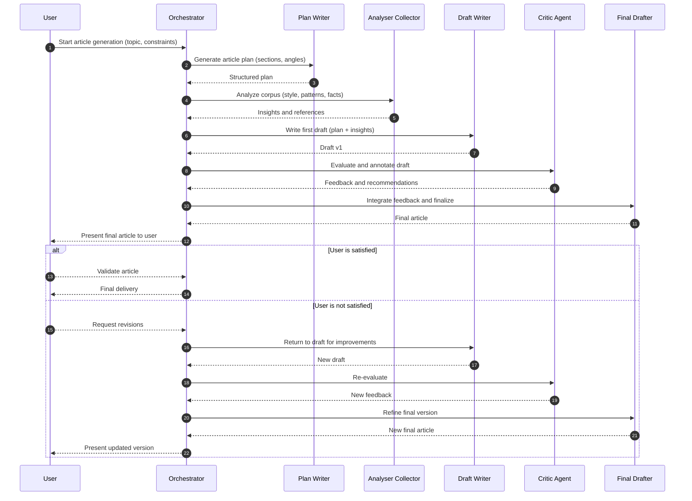

Sure! Here’s your **Agentic-Times** project description fully translated into clear, professional English while keeping your structure and technical tone intact:

---

# Agentic-Times

Project developed as part of the **Designing Agentic Systems** course at **Les Mines Paris**.

## 📋 Description

This project aims to create a **robust multi-agent workflow** for the automated writing of articles of any kind.
The system uses a **multi-agent architecture**, where each agent specializes in a specific task within the writing process.
The agents are enriched by a **corpus of reference articles** (from *The Guardian*), which serves as a benchmark for editorial quality and style.

## 🏗️ Architecture

The system is organized around an **orchestrator** that coordinates several specialized agents:

### Workflow Agents

1. **Orchestrator** (`orchestrator.py`)

   * Coordinates the entire writing workflow
   * Manages the execution sequence of the agents
   * Ensures communication between the agents

2. **Plan Writer** (`plan_writer.py`)

   * Designs the structural outline of the article
   * Defines the main sections and their organization
   * Provides the base structure for drafting

3. **Analyser Collector** (`analyser_collector.py`)

   * Analyzes the reference corpus
   * Extracts and collects relevant information
   * Identifies editorial patterns and style

4. **Draft Writer** (`draft_writer.py`)

   * Writes the first version of the article
   * Relies on the plan and corpus insights
   * Produces an initial draft

5. **Critic Agent** (`critic_agent.py`)

   * Evaluates the quality of the draft
   * Identifies points for improvement
   * Provides feedback and recommendations

6. **Final Drafter** (`final_drafter.py`)

   * Integrates the critic’s feedback
   * Produces the final version of the article
   * Ensures overall consistency and quality

## 🔄 Interaction Workflow

The following diagram illustrates the reviewed workflow sequence, where the user examines the final version and can request improvements if needed.
If the user is not satisfied, the article returns to “draft mode” for adjustments until validation.



## 📁 Project Structure

```
Agentic-Systems/
├── agents/              # Implementation of all agents
│   ├── orchestrator.py
│   ├── plan_writer.py
│   ├── analyser_collector.py
│   ├── draft_writer.py
│   ├── critic_agent.py
│   └── final_drafter.py
├── prompts/             # Prompts for each agent
│   ├── plan_writer.md
│   ├── analyser_collector.md
│   ├── draft_writer.md
│   ├── critic_agent.md
│   └── final_drafter.md
├── data/
│   └── raw/             # Articles scraped from The Guardian
│       └── *.html
├── outputs/             # Articles generated by the system
├── ntb/                 # Development and exploration notebooks
│   └── corpus.ipynb     # Script for collecting articles
├── main.py              # Main entry point
└── README.md
```

## 🚀 Usage

### Prerequisites

* Python 3.x
* The Guardian API key (for article scraping)
* Python dependencies (listed in `requirements.txt`)

### Installation

1. Clone the repository

2. Install dependencies:

   ```bash
   pip install -r requirements.txt
   ```

3. Configure environment variables:

   ```bash
   cp .env.example .env
   # Edit .env and add your Guardian API key
   ```

### Corpus Collection

The notebook `ntb/corpus.ipynb` allows you to scrape articles from The Guardian API to build the reference corpus.

```python
download_guardian_articles(nb_articles=32, topic="your_topic")
```

### Execution

```bash
python main.py
```

## 🎯 Objectives

* **Robustness** – Error handling and validation at every step
* **Quality** – Editorial-quality writing based on reference corpus
* **Flexibility** – Adaptable to different article types and topics
* **Modularity** – Modular architecture for easy agent addition or modification

## 📚 Reference Corpus

The system relies on a corpus of articles scraped from **The Guardian**, a reputable source known for high-quality journalism.
These articles serve as reference for:

* Editorial style
* Article structure
* Writing best practices
* Content analysis

## 🔧 Technologies

* Python
* The Guardian API
* Multi-agent architecture
* Structured prompting system
