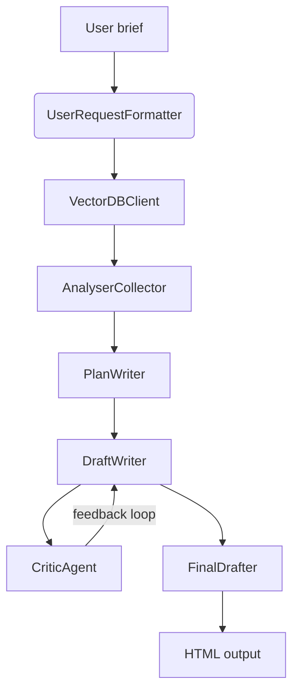

# Agentic Times

Agentic Times is a newsroom-in-a-box that turns a short editorial brief into a fact-grounded, Guardian-style article. It couples retrieval-augmented generation with a chain of specialised agents that format the request, search a curated corpus, draft long-form copy, critique it, and publish HTML output. The system was first built for the *Designing Agentic Systems* course at *Mines Paris* and is now a reusable playground for multi-agent workflows and prompt engineering.

---

## Table of Contents

1. [Project Highlights](#project-highlights)
2. [Architecture](#architecture)
3. [Repository Map](#repository-map)
4. [Core Components](#core-components)
5. [Data & Embeddings Pipeline](#data--embeddings-pipeline)
6. [Environment Setup](#environment-setup)
7. [Configuration](#configuration)
8. [Running the Pipeline](#running-the-pipeline)
9. [Prompt Customisation](#prompt-customisation)
10. [Outputs & Assets](#outputs--assets)
11. [Development Workflow](#development-workflow)
12. [Troubleshooting & FAQ](#troubleshooting--faq)
13. [Roadmap](#roadmap)
14. [License](#license)

---

## Project Highlights

- **Retrieval-aware journalism** – Semantic similarity search over a Guardian-based corpus injects concrete facts into every outline and draft.
- **Agentic workflow** – Dedicated agents cover request formatting, retrieval, planning, drafting, critique, and final rendering; each has its own prompt pack and LLM configuration.
- **Provider flexibility** – Agents auto-detect credentials (`GITHUB_APIKEY` or `OPENAI_APIKEY`) and transparently fall back between Azure-hosted GitHub Models and OpenAI.
- **Prompt override system** – Prompts live in `prompts/*.txt` with `[[section]]` blocks, so tone or structure tweaks never require code changes.
- **Human-in-the-loop loop** – The orchestrator can request human approval after each critique and merge human comments with automated feedback.
- **Publish-ready HTML** – Drafts are post-processed into a Guardian-style page with typography, metadata banner, and optional by-lines.

---

## Architecture



- `UserRequestFormatter` harmonises the brief and extracts search keywords.
- `VectorDBClient` queries the embedding space built from Guardian articles.
- `AnalyserCollector` aggregates the most relevant snippets for downstream prompts.
- `PlanWriter` crafts a long-form outline with titles, sections, and references.
- `DraftWriter` fills the plan while enforcing source citation rules.
- `CriticAgent` grades the copy (0–10) and splits feedback into strengths vs. improvements.
- `FinalDrafter` assembles the tagged draft into styled HTML.

---

## Repository Map

```
Agentic_Times/
├── agents/
│   ├── analyser_collector.py   # request formatter + retrieval orchestrator
│   ├── critic_agent.py         # JSON-formatted critique + scoring
│   ├── draft_writer.py         # long-form article generation with citations
│   ├── final_drafter.py        # Guardian-flavoured HTML renderer
│   ├── orchestrator.py         # high-level pipeline & human feedback loop
│   ├── plan_writer.py          # outline generator
│   ├── prompt_loader.py        # [[section]] prompt parsing helpers
│   └── vector_db.py            # numpy-based ANN search over embeddings
├── data/
│   ├── raw/                    # Guardian HTML corpus (scraped)
│   └── vectors_base/           # embeddings.npy + metadata.jsonl (chunk index)
├── ntb/
│   ├── corpus.ipynb            # acquisition & cleaning of Guardian articles
│   └── embeddings.ipynb        # tokenisation + embeddings export
├── outputs/                    # generated HTML stories
├── prompts/                    # editable prompt packs (TXT)
├── exe.ipynb                  # exploratory runs / smoke tests
└── requirements.txt            # pinned dependencies (Python 3.10+)
```

---

## Core Components

| Module | Role | Key Notes |
| ------ | ---- | --------- |
| `agents/analyser_collector.py` | Formats the request and consolidates relevant corpus snippets. | Auto-selects Azure or OpenAI; wraps search results into `{source: html}` dicts for downstream agents. |
| `agents/vector_db.py` | Loads embeddings/metadata and performs cosine ANN search. | Uses `sentence-transformers/all-MiniLM-L6-v2`; can reconstruct chunk text straight from HTML files. |
| `agents/plan_writer.py` | Produces the article outline. | Injects corpus excerpts into the system prompt when available; prompt sections can be overridden. |
| `agents/draft_writer.py` | Generates the full article. | Enforces citations (`[source: filename]`) and applies critic/user feedback in successive iterations. |
| `agents/critic_agent.py` | Scores and critiques drafts. | Returns JSON with `comments.strengths`, `comments.improvements`, and `note` (float). |
| `agents/final_drafter.py` | Converts tagged drafts to HTML. | Supports multiple authors, publication date, and Guardian-inspired CSS. |
| `agents/orchestrator.py` | Ties everything together. | `exe()` runs a default pipeline; iterative loop requests human validation and persists HTML under `outputs/`. |
| `agents/prompt_loader.py` | Shared prompt utilities. | Parses `[[section]]` markers; defaults to embedded prompts if a section is missing. |

These modules are deliberately lightweight so you can swap LLM providers, extend the workflow (e.g. add fact checkers), or port the retrieval layer to a hosted vector database.

---

## Data & Embeddings Pipeline

1. **Article acquisition** – Use `ntb/corpus.ipynb` (or a custom script) with a Guardian API key to download HTML into `data/raw/`.
2. **Chunking & embedding** – Execute `ntb/embeddings.ipynb`. It tokenises content, creates overlapping chunks, embeds them with `sentence-transformers/all-MiniLM-L6-v2`, and exports:
   - `data/vectors_base/embeddings.npy`
   - `data/vectors_base/metadata.jsonl` (chunk metadata, including the origin file)
3. **Runtime retrieval** – At runtime the `VectorDBClient` lazily loads embeddings, metadata, and optionally reads back HTML to rebuild chunk text when needed.

Make sure both files exist before running the newsroom pipeline. For large corpora you may want to pre-load `SentenceTransformer` weights in a warm service to avoid cold-start latency.

---

## Environment Setup

```bash
python -m venv .venv
source .venv/bin/activate
pip install --upgrade pip
pip install -r requirements.txt
```

The dependency list is intentionally explicit (Jupyter stack for notebooks, LangChain for OpenAI, Azure inference SDK, `sentence-transformers`, etc.). Expect a sizeable install the first time because of PyTorch and transformer weights.

---

## Configuration

Environment variables are loaded from `.venv/.env` by every agent. Minimal configuration:

```
# Required: at least one provider key
GITHUB_APIKEY=...         # Azure-hosted GitHub Models key
OPENAI_APIKEY=...         # OpenAI key

# Optional: overrides
AZURE_ENDPOINT=https://models.github.ai/inference
GUARDIAN_APIKEY=...       # needed only when refreshing the corpus
```

Tips:

- When both keys are set the agents try Azure first (GitHub Models) and fall back to OpenAI if initialisation fails.
- If you change prompts or environment variables while a REPL is running, restart the session to reload configuration.
- Large retrieval runs can be memory-intensive; consider running notebooks on a machine with >8 GB RAM.

---

## Running the Pipeline

### 1. End-to-end article generation

```python
from agents import orchestrator

request = "Write a 900-word analysis on the climate impact of urban freight in Europe."
output_path = orchestrator.exe(
    user_request=request,
    authors=["John Doe"],
    note_threshold=8.0,
    max_iter=5,
)

print(f"Article saved to: {output_path}")
```

This runs formatting, retrieval, plan writing, drafting, iterative critique with human approval prompts, and finally saves an HTML article to `outputs/<slug>.html`.

### 2. Iterative improvement loop

The orchestrator prompts for human satisfaction after each critic review. Provide additional feedback in the console to force another rewrite even if the critic score clears the threshold.

### 3. Using components individually

- Call `UserRequestFormatter.format()` to inspect extracted themes.
- Use `VectorDBClient.search("term")` to debug retrieval scores.
- Invoke `PlanWriter.format(user_request, articles)` to prototype prompt changes without running the full pipeline.

Each agent accepts `provider="azure" | "openai" | "auto"` and LLM parameters (model name, endpoint, etc.).

---

## Prompt Customisation

- Prompt packs sit in `prompts/*.txt`.
- Each section is labelled with `[[section_name]]` and loaded case-insensitively.
- Missing sections fall back to defaults embedded in code, making overrides opt-in.
- Restart your Python session (or reload the module) after editing a prompt file.

Example (`prompts/draft_writer.txt`):

```
[[system]]
You are the house style editor for Agentic Times...

[[feedback_instruction]]
- Prioritise the latest critic feedback when conflicts appear.
```

To experiment quickly, fork the notebook `exe.ipynb` and run cells that call individual agents with custom prompt tweaks.

---

## Outputs & Assets

- HTML stories generated by `orchestrator.exe()` are stored in `outputs/`.
- `FinalDrafter` expects drafts to use `[title]`, `[subtitle]`, and `[paragraph]` tags. Additional lines are rendered as paragraphs by default.
- Embedding artefacts (`embeddings.npy`, `metadata.jsonl`) live under `data/vectors_base/`.
- Raw Guardian HTML is kept in `data/raw/`, matching filenames referenced in metadata and citations.

---

## Development Workflow

1. **Branching** – Create a feature branch before modifying prompts or agents.
2. **Corpus changes** – Keep Guardian HTML files out of version control if they derive from licensed content.
3. **Testing** – Use `exe.ipynb` or craft script-level smoke tests (none are provided yet). Consider adding unit tests for prompt parsing or vector search.
4. **Provider parity** – When possible, test with both Azure GitHub Models and OpenAI to ensure prompts work across providers.
5. **Style** – Prompts should stay English to align with critic scoring, even if final articles are in other languages.

---

## Troubleshooting & FAQ

- **`ValueError: No API key found`** – Ensure `.venv/.env` contains either `GITHUB_APIKEY` or `OPENAI_APIKEY` and that the virtualenv is activated.
- **`ImportError: langchain_openai is not installed`** – `langchain-openai` is pinned in `requirements.txt`; reinstall dependencies if needed.
- **Model cold start latency** – `VectorDBClient` loads `sentence-transformers` weights on import. For batch processing, run a warm service or cache the model instance.
- **Empty retrieval results** – Check that `embeddings.npy` and `metadata.jsonl` exist and that `similarity_threshold` (default `0.3`) is not too high for niche queries.
- **HTML lacks title/metadata** – Ensure the draft includes a `[title]` line; otherwise `FinalDrafter` inserts a fallback headline.

---

## Roadmap

- Integrate a post-critique editing pass in `FinalDrafter` (currently a placeholder for future human/LLM polishing).
- Add automated regression tests for prompts, retrieval quality, and HTML rendering.
- Provide a CLI interface wrapping `orchestrator.exe()` for non-Python users.
- Investigate migrating embeddings to a service-based vector DB (e.g. Qdrant, Pinecone) to avoid local loading time.

---

## License

This project is distributed for educational purposes. Contact the authors before deploying Agentic Times in production or redistributing the Guardian-derived corpus.
