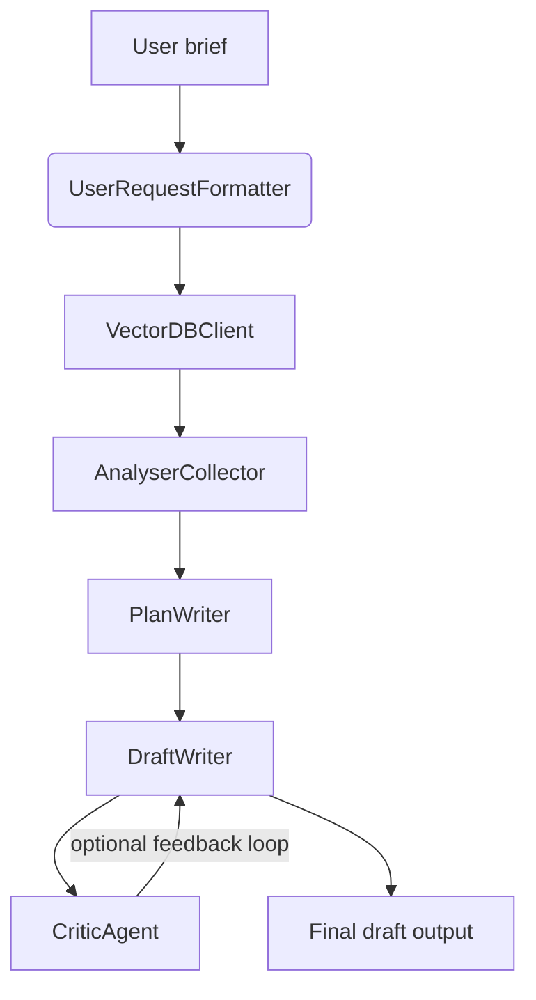

# Agentic Times

Agentic Times is a multi-agent newsroom pipeline that automates long-form article production. It brings together retrieval-augmented generation, iterative critique, and modular prompting so that new briefs can be turned into publication-ready drafts with minimal human input.

The project was originally developed for the *Designing Agentic Systems* course at *Mines Paris* and has since been extended with richer prompt management, multi-provider LLM support (Azure OpenAI & OpenAI), and reusable tooling for building article corpora.

## Why It Matters

- **Research-aware writing** – Semantic search over a Guardian-based corpus feeds every plan and draft with concrete references.
- **Specialised agents** – Each step (request formatting, planning, drafting, critique) is backed by its own prompt set and LLM settings.
- **Provider flexibility** – Agents auto-detect available credentials and can fall back between Azure-hosted GitHub Models and OpenAI.
- **Prompt override system** – Prompts live in `prompts/*.txt` files with `[[section]]` blocks so teams can adapt tone, structure, or outputs without touching code.
- **Iterative review loop** – Drafts can be graded and re-written until they reach a target quality score.

## System Overview



- `UserRequestFormatter` extracts themes and keywords to drive semantic retrieval.
- `VectorDBClient` performs ANN search over Guardian articles stored as embeddings and metadata.
- `AnalyserCollector` packages the most relevant source snippets for downstream prompts.
- `PlanWriter` delivers a structured outline that the drafter must follow.
- `DraftWriter` produces a fully formatted article, citing every borrowed fact.
- `CriticAgent` scores the draft and splits feedback into strengths vs. improvements; the feedback feeds iterative rewrites.
- `final_drafter.py` is a placeholder for future work (human-in-the-loop polishing or another LLM pass).

## Repository Layout

```
Agentic_Times/
├── agents/
│   ├── analyser_collector.py   # semantic search + context assembly
│   ├── critic_agent.py         # structured review + scoring
│   ├── draft_writer.py         # article generation with citation rules
│   ├── final_drafter.py        # TODO: post-critique synthesis
│   ├── orchestrator.py         # high-level workflow helpers (exe / iterative loop)
│   ├── plan_writer.py          # outline generation
│   ├── prompt_loader.py        # [[section]] prompt parser
│   └── vector_db.py            # NumPy + sentence-transformers vector store
├── data/
│   ├── raw/                    # Guardian HTML corpus (scraped)
│   └── vectors_base/           # embeddings.npy + metadata.jsonl
├── ntb/
│   ├── corpus.ipynb            # crawl Guardian content & prepare HTML
│   └── embeddings.ipynb        # build/update vector store artefacts
├── prompts/                    # editable prompt packs (TXT with sections)
├── outputs/                    # generated articles (optional)
├── test.ipynb
└── requirements.txt
```

## Getting Started

### 1. Prerequisites

- Python 3.10+
- Access to at least one LLM provider:
  - `GITHUB_APIKEY` (GitHub Models endpoint compatible with Azure inference API)
  - or `OPENAI_APIKEY`
- A Guardian API key if you intend to expand the corpus yourself.
- `sentence-transformers` weights are downloaded automatically when embeddings are built.

### 2. Environment Setup

```bash
python -m venv .venv
source .venv/bin/activate
pip install --upgrade pip
pip install -r requirements.txt
```

Store secrets in `.venv/.env` so that agents can auto-load them:

```
GITHUB_APIKEY=...
AZURE_ENDPOINT=https://models.github.ai/inference   # optional override
OPENAI_APIKEY=...
GUARDIAN_APIKEY=...                                # optional, for corpus updates
```

### 3. Build or Update the Corpus

1. Use `ntb/corpus.ipynb` (or your own script) to pull Guardian articles into `data/raw/`.
2. Run `ntb/embeddings.ipynb` to chunk articles, embed them with `sentence-transformers/all-MiniLM-L6-v2`, and export:
   - `data/vectors_base/embeddings.npy`
   - `data/vectors_base/metadata.jsonl`

The retrieval stack expects those artefacts to exist before any generation run.

## Using the Agents

### Quick generation

```python
from agents import orchestrator

request = "Write a 900-word analysis on the climate impact of urban freight in Europe."
draft = orchestrator.exe(request)
print(draft)
```

### Iterative improvement loop

```python
result = orchestrator.iterative_draft_improve(
    user_request=request,
    note_threshold=8.5,
    max_iter=4,
)

print(result["final_score"])
print(result["comments"]["improvements"])
print(result["final_draft"])
```

`iterative_draft_improve` keeps calling the critic until the score meets the threshold (or the maximum number of iterations is reached). Each pass reuses the same plan and context but injects the critic’s feedback as additional guidance for the drafter.

### Custom prompts

- Each agent looks for a matching file in `prompts/`.  
- Files are plain text and can contain multiple sections using `[[section_name]]`.  
- Any missing section falls back to the default embedded in code.  

Example (`prompts/draft_writer.txt`):

```
[[system]]
You are the house style editor for Agentic Times...

[[feedback_instruction]]
- Prioritise the latest critic feedback when conflicts appear.
```

Reloading the module (or restarting the process) is enough to pick up changes.

## Current Limitations & Roadmap

- `final_drafter.py` is a stub; integrating it would enable post-critique edits or human approval loops.
- `main.py` predates the current orchestrator helpers and needs alignment before being used as a CLI entry point.
- Retrieval currently loads `sentence-transformers` weights on every process start; consider persisting the `SentenceTransformer` instance or migrating to a vector DB service for production.
- No automated tests are included yet; notebooks capture most of the data prep logic.

## Contributing

1. Fork the repo and create a feature branch.
2. Keep prompts and credentials out of version control.
3. Run generation/critique flows with both Azure and OpenAI credentials when possible to ensure parity.
4. Open a pull request describing rationale, demo inputs/outputs, and any prompt changes.

## License

This project is released for educational purposes. See the course guidelines or contact the authors before reusing it in production settings.
