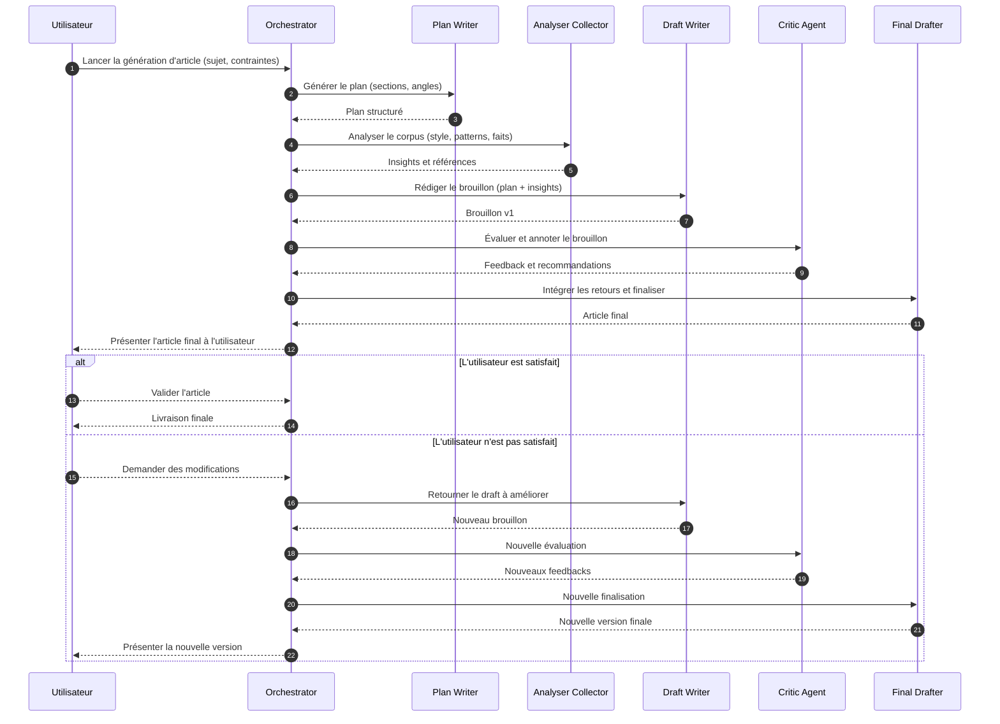

# Agentic-Systems

Projet réalisé dans le cadre du cours **Designing Agentic Systems** à **Les Mines Paris - Albert School**.

## 📋 Description

Ce projet vise à créer un **workflow d'agents robuste** pour la rédaction automatisée d'articles de tout type. Le système utilise une architecture multi-agents où chaque agent est spécialisé dans une tâche spécifique du processus de rédaction. Les agents sont enrichis par un **corpus d'articles reconnus** (The Guardian) qui sert de référence pour la qualité et le style éditorial.

## 🏗️ Architecture

Le système est organisé autour d'un orchestrateur qui coordonne plusieurs agents spécialisés :

### Agents du Workflow

1. **Orchestrator** (`orchestrator.py`)
   - Coordonne l'ensemble du workflow de rédaction
   - Gère la séquence d'exécution des agents
   - Assure la communication entre les différents agents

2. **Plan Writer** (`plan_writer.py`)
   - Élabore le plan structurel de l'article
   - Définit les sections principales et leur organisation
   - Fournit une structure de base pour la rédaction

3. **Analyser Collector** (`analyser_collector.py`)
   - Analyse le corpus d'articles de référence
   - Collecte et extrait les informations pertinentes
   - Identifie les patterns et le style éditorial

4. **Draft Writer** (`draft_writer.py`)
   - Rédige une première version de l'article
   - S'appuie sur le plan et les analyses du corpus
   - Produit un brouillon initial

5. **Critic Agent** (`critic_agent.py`)
   - Évalue la qualité du brouillon
   - Identifie les points à améliorer
   - Fournit des suggestions de correction

6. **Final Drafter** (`final_drafter.py`)
   - Intègre les retours du critique
   - Produit la version finale de l'article
   - Assure la cohérence et la qualité finale

## 🔄 Schéma des interactions entre agents

Le diagramme ci-dessous illustre la séquence revue, où l'utilisateur examine la version finale et peut demander des améliorations si besoin. Si l'utilisateur n'est pas satisfait, l'article retourne en mode "brouillon" pour ajustements, jusqu'à validation.




## 📁 Structure du Projet

```
Agentic-Systems/
├── agents/              # Implémentation des différents agents
│   ├── orchestrator.py
│   ├── plan_writer.py
│   ├── analyser_collector.py
│   ├── draft_writer.py
│   ├── critic_agent.py
│   └── final_drafter.py
├── prompts/             # Prompts pour chaque agent
│   ├── plan_writer.md
│   ├── analyser_collector.md
│   ├── draft_writer.md
│   ├── critic_agent.md
│   └── final_drafter.md
├── data/
│   └── raw/            # Articles scrappés depuis The Guardian
│       └── *.html
├── outputs/            # Articles générés par le système
├── ntb/               # Notebooks d'exploration et de développement
│   └── corpus.ipynb   # Script de collecte d'articles
├── main.py            # Point d'entrée principal
└── README.md
```

## 🚀 Utilisation

### Prérequis

- Python 3.x
- Clé API The Guardian (pour le scraping d'articles)
- Dépendances Python (à définir dans `requirements.txt`)

### Installation

1. Cloner le dépôt
2. Installer les dépendances :
   ```bash
   pip install -r requirements.txt
   ```

3. Configurer les variables d'environnement :
   ```bash
   cp .env.example .env
   # Éditer .env et ajouter votre clé API The Guardian
   ```

### Collecte du Corpus

Le notebook `ntb/corpus.ipynb` permet de scraper des articles depuis The Guardian API pour constituer le corpus de référence.

```python
download_guardian_articles(nb_articles=32, sujet="your_topic")
```

### Exécution

```bash
python main.py
```

## 🎯 Objectifs

- **Robustesse** : Gestion des erreurs et validation à chaque étape
- **Qualité** : Production d'articles de qualité éditoriale grâce au corpus de référence
- **Flexibilité** : Adaptation à différents types d'articles et sujets
- **Modularité** : Architecture modulaire permettant l'ajout ou la modification d'agents

## 📚 Corpus de Référence

Le système utilise un corpus d'articles scrappés depuis **The Guardian**, une source reconnue pour la qualité de son journalisme. Ces articles servent de référence pour :
- Le style éditorial
- La structure des articles
- Les bonnes pratiques de rédaction
- L'analyse de contenu

## 🔧 Technologies

- Python
- API The Guardian
- Architecture multi-agents
- Système de prompts structurés

## 👥 Équipe

Projet réalisé dans le cadre du cours Designing Agentic Systems à Les Mines Paris - Albert School.
